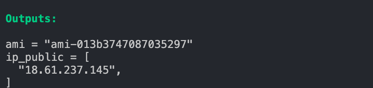
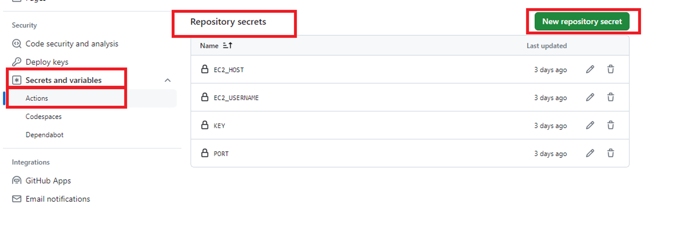
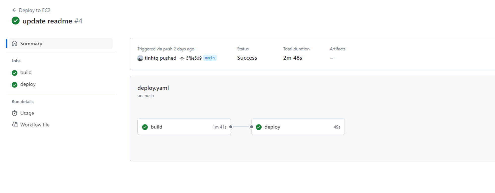

# DevOps Exercise

## Walkthrough

**Step 1:** Provision EC2

Go to the infrastructure folder

Execute the bellow command to provision EC2 with Docker installed

```bash
terraform init
terraform apply --auto-approve
```



Update the IP in `docker-compose.yaml` file. Create a directory in Ec2 that contains the docker-compose file. Save it as **DIRECTORY** variable.

**Step 2:** Create Repository Secrets

Go to Settings → Secrets and variables → Repository secrets → New repository secret.



**Step 3**: Create a Github Workflow

Create `.github/workflows/deploy.yaml` file

```docker
name: Deploy to VPS
on:
  push:
    branches:
      - main

jobs:
  build:
    runs-on: ubuntu-latest
    permissions:
      contents: read
      packages: write
    steps:
      - name: Checkout
        uses: actions/checkout@v4
      - name: Set up QEMU
        uses: docker/setup-qemu-action@v3
      - name: Set up Docker Buildx
        uses: docker/setup-buildx-action@v3
      - name: Login to GitHub Container Registry
        uses: docker/login-action@v3
        with:
          registry: ghcr.io
          username: ${{ github.repository_owner }}
          password: ${{ secrets.GITHUB_TOKEN }}
      - name: Set SHA-COMMIT
        id: vars
        run: echo "sha_short=$(git rev-parse --short HEAD)" >> $GITHUB_OUTPUT
      - name: Build and push backend
        uses: docker/build-push-action@v5
        with:
          context: back
          platforms: linux/amd64
          push: true
          tags: |
            ghcr.io/Ngozi34/May-backend:latest
            ghcr.io/Ngozi34/May-backend:${{ steps.vars.outputs.sha_short }}

      - name: Build and push frontend
        uses: docker/build-push-action@v5
        with:
          context: front
          platforms: linux/amd64
          push: true
          tags: |
            ghcr.io/Ngozi34/May-frontend:latest
            ghcr.io/Ngozi34/May-frontend:${{ steps.vars.outputs.sha_short }}
  deploy:
    needs: build
    runs-on: ubuntu-latest
    timeout-minutes: 5
    steps:
      - name: Deploy
        uses: appleboy/ssh-action@v1.0.3
        with:
          host: ${{ secrets.EC2_HOST }}
          username: ${{ secrets.EC2_USERNAME }}
          key: ${{ secrets.KEY }}
          port: ${{ secrets.PORT }}
          command_timeout: 30m
          script: |
            cd ${{ vars.DIRECTORY }}
            docker compose pull
            docker compose up -d
```

**Step 4**: Test it

Push a commit to this repository and see the result.



## Preferences

[My Article in Medium](https://medium.com/@tinhtq97/basic-cicd-with-github-action-a3aae8f233d1)
